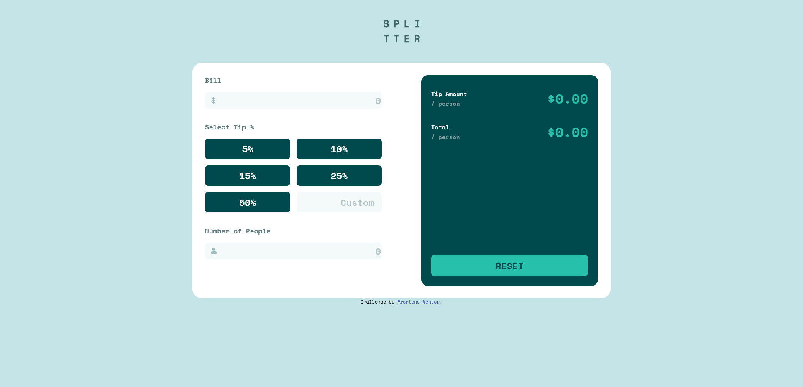

# Frontend Mentor - Tip calculator app solution

This is a solution to the [Tip calculator app challenge on Frontend Mentor](https://www.frontendmentor.io/challenges/tip-calculator-app-ugJNGbJUX). Frontend Mentor challenges help you improve your coding skills by building realistic projects.

## Table of contents

- [Overview](#overview)
  - [The challenge](#the-challenge)
  - [Screenshot](#screenshot)
  - [Links](#links)
- [My process](#my-process)
  - [Built with](#built-with)
  - [What I learned](#what-i-learned)
- [Author](#author)
**Note: Delete this note and update the table of contents based on what sections you keep.**

## Overview

### The challenge

Users should be able to:

- View the optimal layout for the app depending on their device's screen size
- See hover states for all interactive elements on the page
- Calculate the correct tip and total cost of the bill per person

### Screenshot

### Links

- Live Site URL: [Add live site URL here](https://tobomuto.github.io/tip-calculator-app-main/)

## My process

### Built with

- Semantic HTML5 markup
- SASS (with gulp to render and update the css)
- Vanilla Javascript (no Jquery)
- Flexbox
- Mobile-first workflow

### What I learned

- I experimented with this challenge the mobile-first workflow, indeed better than a desktop focused css.
- Just to try something new, I used gulp to render SASS in css.
- I'm used to work on vue, I wanted to do this with only vanilla JS.

### Continued development

- I guess my code is pretty ugly and not very maintanable. I need to work on that.
- Should check on BEM css

## Author

- Website - [Thomas Bouvier](https://tombvr.fr)
- Frontend Mentor - [@tobomuto](https://www.frontendmentor.io/profile/tobomuto)